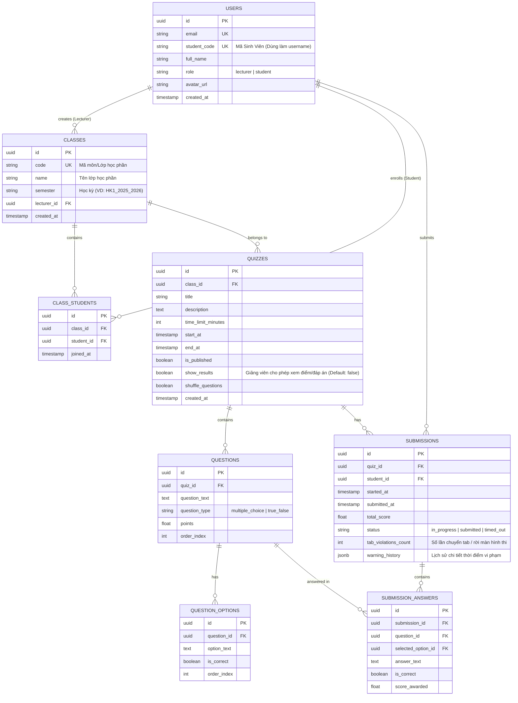

# MASTERPLAN: Hệ Thống Quiz & Quản Lý Điểm Số Tự Động (University Quiz System)

> **Role**: Senior Full-Stack Developer, Technical Architect & Product Manager  
> **Approach**: Vibe Coding - Thiết kế tối ưu cho AI generation, mã nguồn sạch, mở rộng tốt và bảo mật cao.

---

## 1. Đề Xuất Tech Stack (Tối Ưu Cho Vibe Coding)

| Tầng (Layer) | Công nghệ lựa chọn | Lý do lựa chọn & Lợi ích Vibe Coding |
| :--- | :--- | :--- |
| **Frontend Framework** | **Next.js 14+ (App Router)** | Framework React chuẩn mực, hỗ trợ Server Components & Server Actions giúp viết API và giao diện trong cùng một repo. Rất thân thiện với các công cụ AI code generator. |
| **Styling & UI Kit** | **TailwindCSS + shadcn/ui** | **shadcn/ui** là bộ component cao cấp, chuẩn accessibility, dễ tùy biến code trực tiếp. **TailwindCSS** giúp AI gen UI chuẩn responsive, mượt mà và trực quan nhanh chóng. |
| **Database & Backend** | **Supabase (PostgreSQL)** | "Firebase thay thế nguồn mở" trên nền PostgreSQL. Cung cấp Auth tích hợp, Database Realtime, Storage và Row Level Security (RLS) bảo mật dữ liệu ở cấp cơ sở dữ liệu. |
| **Auth & Security** | **Supabase Auth + Custom Student Auth** | Hỗ trợ đăng nhập theo Mã Sinh Viên + Mật khẩu mặc định do Giảng viên tạo, và Email/Password dành cho Giảng viên. |
| **Data Processing** | **SheetJS (xlsx) / PapaParse** | Đọc/Xử lý file Excel chứa danh sách sinh viên do Giảng viên upload để tự động tạo tài khoản và xếp lớp. Xuất bảng điểm chi tiết ra Excel/CSV. |
| **Hosting & Deployment** | **Vercel + Supabase Cloud** | Triển khai 1-click CI/CD từ GitHub. Không cần quản lý VPS/Linux server. Đảm bảo uptime 99.9% và tốc độ tải trang cực nhanh. |

---

## 2. Bản Phác Thảo Kiến Trúc Dữ Liệu (Database Schema Model)

Hệ thống sử dụng cơ sở dữ liệu quan hệ **PostgreSQL (Supabase)** với các bảng chính và mối quan hệ đã được tinh chỉnh theo yêu cầu bài toán:



### Quy tắc Nghiệp vụ (Business Logic Rules):

1. **Đăng nhập & Gán lớp tự động (Student Import & Auto-Detect)**:
   - Giảng viên upload file Excel lớp học (chỉ cần 2 cột: `Mã SV` và `Họ và Tên`, email trường sẽ tự động được sinh theo định dạng `@student.university.edu.vn`).
   - Hệ thống tự động tạo tài khoản Sinh viên với `student_code` + mật khẩu mặc định (ví dụ: `123456` hoặc `MãSV@123`).
   - Khi Sinh viên đăng nhập bằng `Mã SV`, hệ thống tự phát hiện và hiển thị đúng các Lớp học phần mà Sinh viên đó đã được Giảng viên phân vào.
2. **Quyền xem điểm & Đáp án (Controlled Result Visibility)**:
   - Mặc định sau khi làm bài xong, sinh viên **CHƯA được xem điểm và đáp án** (nhằm tránh lộ đáp án cho các ca thi/lớp sau).
   - Chỉ khi Giảng viên chủ động gạt cờ `show_results = true` cho bài Quiz đó, Sinh viên mới xem được kết quả & đáp án chi tiết.
3. **Phòng thi & Chống gian lận (Exam Engine & Anti-Cheat)**:
   - **Rút ngẫu nhiên N câu từ Ngân hàng đề**: Giảng viên có thể soạn 20, 50 hay 100 câu hỏi vào Ngân hàng đề. Khi bài thi diễn ra, mỗi sinh viên sẽ được hệ thống rút ngẫu nhiên một bộ N câu hỏi (VD: 5 câu) hoàn toàn độc lập.
   - **Trộn câu hỏi & Trộn đáp án (A, B, C, D)**: Mỗi sinh viên khi vào làm bài thi sẽ nhận được đề thi với thứ tự câu hỏi hoàn toàn ngẫu nhiên và thứ tự đáp án lựa chọn đảo vị trí. Sinh viên ngồi cạnh nhau không thể chép bài hay chọn theo mẫu đáp án.
   - **Làm bài tuyến tính (Khóa không cho quay lại câu trước)**: Giảng viên có thể bật tính năng khóa không cho xem lại hoặc sửa câu hỏi đã trôi qua. Sinh viên buộc phải làm bài tuần tự tiến tới.
   - **Giới hạn thời gian (Countdown Timer)**: Tự động tính giờ từ khi bấm "Bắt đầu làm bài", tự động Submit khi đếm ngược về 0.
   - **Giám sát chuyển tab (Tab Switching / Blur Detection)**: Sử dụng HTML5 `visibilitychange` & `window.onblur`. Mỗi lần sinh viên rời tab/rời cửa sổ thi, hệ thống sẽ đưa ra cảnh báo Modal trực tiếp, đồng thời đếm số lần vi phạm `tab_violations_count` và ghi log vào DB để Giảng viên đánh giá.

---

## 3. Lộ Trình Triển Khai (Project Roadmap - 5 Phase)

```
┌─────────────────────────────────────────────────────────────────────────┐
│ PHASE 1: Khởi Tạo Hệ Thống & Hạ Tầng (Project Setup & Architecture)     │
└────────────────────┬────────────────────────────────────────────────────┘
                     ▼
┌─────────────────────────────────────────────────────────────────────────┐
│ PHASE 2: Xác Thực & Quản Lý Lớp Học (Auth & Class Management)          │
└────────────────────┬────────────────────────────────────────────────────┘
                     ▼
┌─────────────────────────────────────────────────────────────────────────┐
│ PHASE 3: Quản Lý Quiz & Ngân Hàng Câu Hỏi (Quiz Builder Engine)         │
└────────────────────┬────────────────────────────────────────────────────┘
                     ▼
┌─────────────────────────────────────────────────────────────────────────┐
│ PHASE 4: Giao Diện Làm Bài & Tự Động Chấm Điểm (Exam & Auto-Grading)    │
└────────────────────┬────────────────────────────────────────────────────┘
                     ▼
┌─────────────────────────────────────────────────────────────────────────┐
│ PHASE 5: Thống Kê, Báo Cáo & Xuất File Excel/CSV (Analytics & Export)   │
└─────────────────────────────────────────────────────────────────────────┘
```

### **Phase 1: Khởi Tạo Hệ Thống & Hạ Tầng (Project Setup & Architecture)**
- Khởi tạo Next.js 14+ (App Router), TailwindCSS & `shadcn/ui`.
- Thiết lập cấu hình kết nối Supabase Client/Server SDK.
- Định nghĩa TypeScript Schemas & Database Migration Scripts cho PostgreSQL.

### **Phase 2: Xác Thực & Quản Lý Lớp Học (Auth & Excel Import)**
- Đăng nhập phân quyền: Giảng viên (Email/Pass) & Sinh viên (Mã SV + Mật khẩu mặc định).
- Module Giảng viên: Tạo lớp học phần, Upload file Excel danh sách sinh viên để tự động khởi tạo tài khoản và ghi danh vào lớp.
- Module Sinh viên: Đăng nhập tự động detect danh sách lớp đã được gán.

### **Phase 3: Quản Lý Quiz & Ngân Hàng Đề Thi Dùng Chung (Test Bank Architecture)**
- **Thư Viện Ngân Hàng Đề Thi Dùng Chung (Central Test Bank)**:
  - Giảng viên soạn đề thi 1 lần duy nhất trong Thư viện Test Bank dùng chung thay vì phải tạo thủ công cho từng lớp riêng lẻ.
  - **Phân công hàng loạt cho nhiều Lớp học phần (Multi-Class Assignment)**: Danh sách tích chọn (Checkboxes) cho phép chọn 1, 2 hoặc tất cả 7 lớp cùng học phần (VD: *Introduction to Logistics & SCM - Nhóm 01, 02, 03...*) để giao bài thi chỉ với 1 click.
- **Nhập Ngân Hàng Câu Hỏi Siêu Tốc (Fast Question Bank Importer)**:
  - **Dán văn bản siêu tốc với ký tự `*`**: Copy toàn bộ nội dung đề thi từ Word/PDF dán vào khung text. Chỉ cần thêm ký tự `*` trước phương án đúng (VD: `*A. Đáp án đúng` hoặc `*Đáp án đúng`), hệ thống tự động bóc tách 100% chính xác trong 1 giây.
  - **Import hàng loạt từ Excel (.xlsx)**: Đọc danh sách hàng chục/hàng trăm câu hỏi + đáp án từ file Excel chỉ với 1 click.
- Soạn thảo câu hỏi (Trắc nghiệm nhiều lựa chọn, Đúng/Sai), đặt điểm và đáp án.

### **Phase 4: Phòng Thi Trực Tuyến, Anti-Cheat & Chấm Điểm (Exam & Grading)**
- Giao diện làm bài thi cho sinh viên:
  - Đồng hồ đếm ngược đồng bộ Client/Server.
  - Tích hợp listener `visibilitychange` để phát hiện và cảnh báo chuyển tab/màn hình.
  - Tự động nộp bài khi hết giờ hoặc vi phạm quá số lần cho phép.
- Server Action chấm điểm tự động & ghi nhận số lần vi phạm `tab_violations_count`.

### **Phase 5: Thống Kê Báo Cáo & Xuất File Excel/CSV (Dashboard & Analytics)**
- Giảng viên gạt bật/tắt cho phép xem điểm `show_results`.
- Thống kê phổ điểm, tỷ lệ hoàn thành, lịch sử vi phạm chuyển tab của sinh viên.
- Export bảng điểm từng Quiz / Tổng hợp cả học kỳ ra Excel/CSV.

---
*MASTERPLAN đã được cập nhật chính xác theo toàn bộ yêu cầu nghiệp vụ của Thầy/Cô!*
